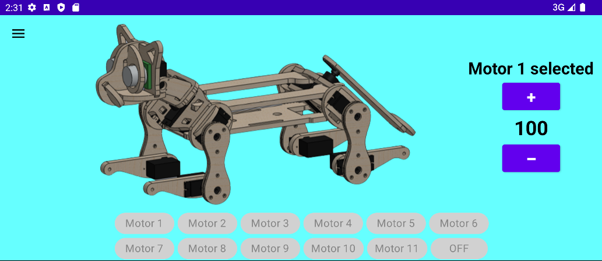
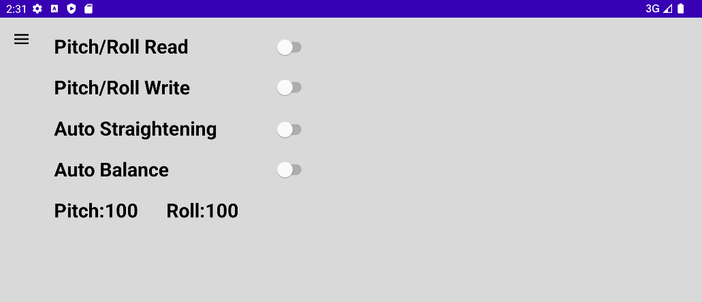
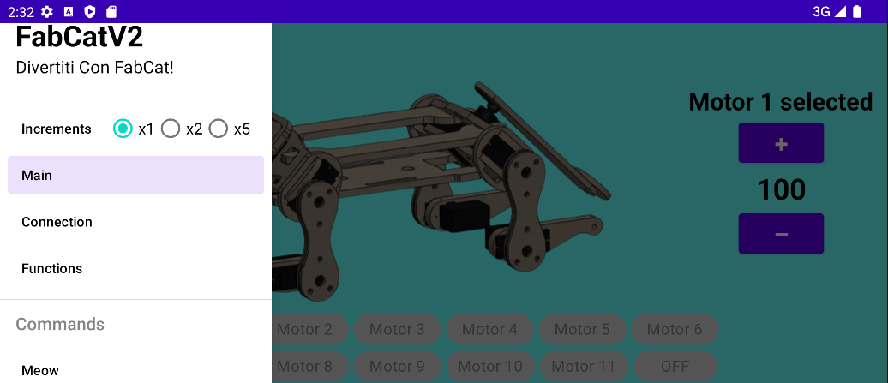
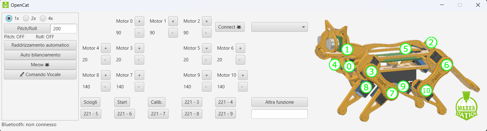
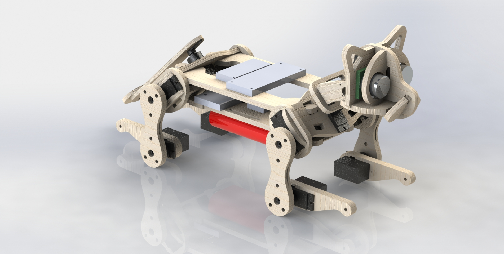
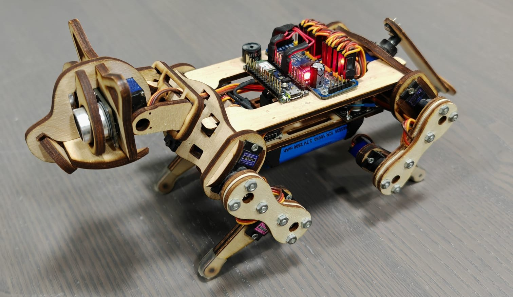
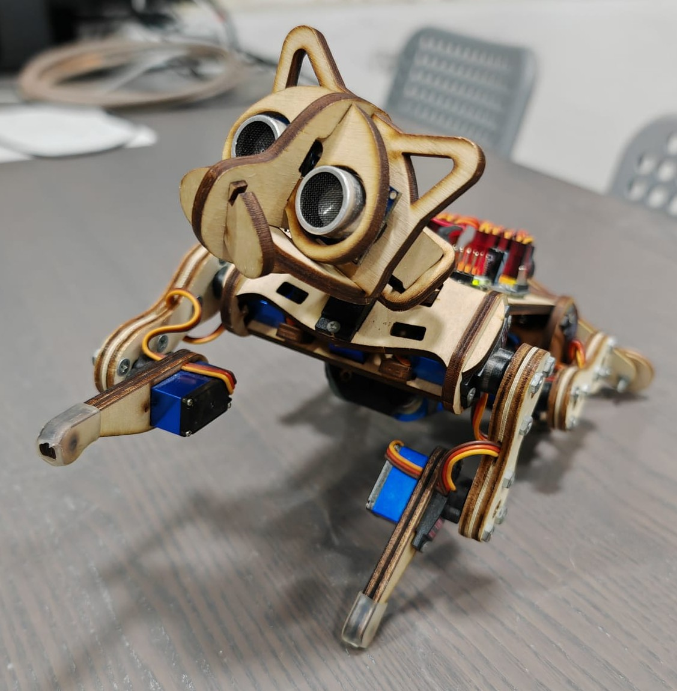
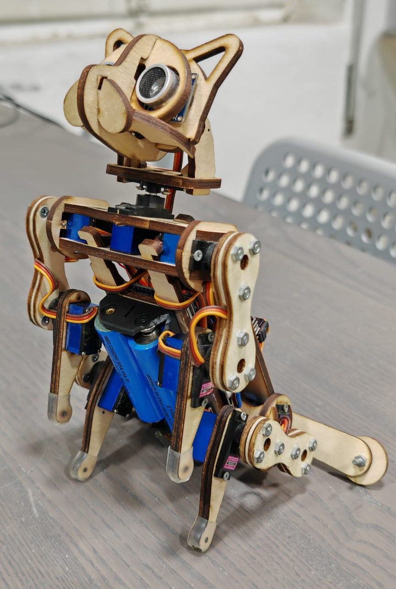

# FabCat

## Descrizione

FabCat è un prototipo di gatto robotico realizzato in legno, progettato con una struttura completamente ad incastro.

Il sistema è stato sviluppato partendo dalla modellazione 3D in ambiente CAD (SolidWorks), successivamente convertita in disegni 2D per il taglio laser (LaserCut / RDWorks). La struttura ottenuta integra componenti elettronici e attuatori, dando origine a un oggetto meccatronico funzionante.

Il dispositivo è basato su Arduino Nano 33 IoT BLE ed è dotato di 11 servomotori. Il comportamento è interamente programmabile e consente l’esecuzione di movimenti semplici, come sedersi, salutare e simulare uno stato di riposo. Il sistema è inoltre in grado di emettere suoni.

---

## Struttura della repository

### /Android

Applicazione Android (Android 11) per il controllo remoto del dispositivo tramite Bluetooth Low Energy.

---

### /Arduino

Contiene le diverse versioni del firmware sviluppato per il controllo del sistema, inclusa la versione principale con la gestione dei movimenti e della logica del dispositivo.

---

### /Java

Applicazione desktop sviluppata in Java per il controllo del dispositivo tramite Bluetooth.

---

### /Modello 2D Lasercut

Raccolta dei file DXF utilizzati per il taglio laser dei componenti in legno.

---

### /Modello 3D SolidWorks

Modelli 3D e assiemi utilizzati durante la fase di progettazione per la definizione degli incastri e della struttura complessiva.

---

## Immagine del prototipo

---